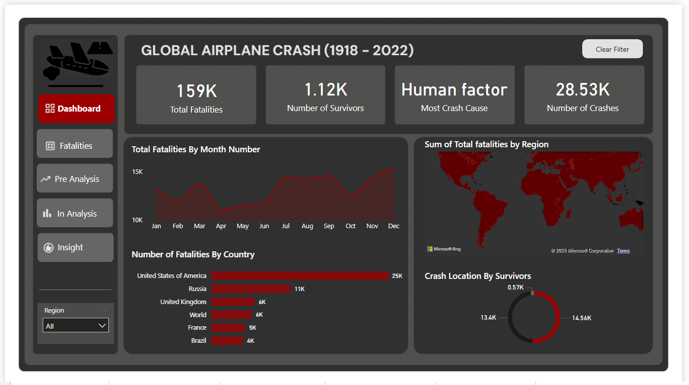

# ✈️ Global Airplane Crash Analysis (1918–2022)

## 📑 Table of Contents
1.	Project Objective
2.	Dataset Overview
3.	Tools Used
4.	Data Preparation
5.	Data Model Summary
6.	Exploratory Data Analysis
7.	Visualization
8.	Key Insights, Implications, and Impacts
9.	Observations
10.	Recommendations

## 🎯 Project Objective
To analyze global airplane crash data from 1918 to 2022, identify key trends, causes, and patterns in aviation accidents, and deliver actionable insights for improving aviation safety. This analysis supports data-driven decisions by aviation authorities, airlines, and safety organizations.

## 📂 Dataset Overview
•	Timeframe: 1918–2022
•	Total Fatalities: 159,000
•	Survivors: 1,120
•	Total Crashes: 28,530
•	Data Dimensions:

## Crash causes
- Aircraft types
- Flight phases
- Regions and countries
- Monthly trends

## 🛠 Tools Used
-	Power BI: Data visualization
-	Power Query: Data processing and transformation
-	Microsoft Excel

Data Source: Aggregated global aviation accident records
## 🧹 Data Preparation

## Data Cleaning:
-	Removed duplicates
-	Handled missing values
-	Standardized date and location formats
-	Feature Engineering:
-	Categorized crash causes
-	Mapped fatalities by aircraft type and flight phase
-	Aggregated data by region and country

•	Transformation:
Structured raw records into analytical tables for effective visualization

## 🗃️ Data Model Summary
## 📁 Entities
-	Crashes: Date, location, cause, phase, aircraft type
-	Fatalities: Passenger, crew, other
-	Survivors
-	Regions & Countries

## 🔗 Relationships
-	Each crash links to a specific aircraft, cause, flight phase, and geographic location
-	Fatalities and survivors are aggregated per crash

## 📊 Exploratory Data Analysis
#✈️ Deadliest Aircraft Types
-	Douglas C-47 Skytrain (DC-3)
-	Lockheed C-130 Hercules
-	Boeing 737-200, Boeing 707, Tupolev TU-154
→ Older aircraft dominate fatality statistics

## ⚠️ Crash Causes
-	Human Error leads overwhelmingly, far above:
-	Technical failure
-	Unknown causes
-	Terrorism/hijacking
-	Weather and other causes

## 🛫 Fatalities by Flight Phase
-	In-Flight, Landing, and Takeoff phases = Most fatal
-	Minimal fatalities in taxiing and parking
👥 Fatalities by Role
-	Passengers: ~66%
-	Crew Members: ~32%
-	Others: Remaining proportion

## 🌍 Fatalities by Country
-	Top 5: USA, Russia, UK, France, Brazil
→ Reflects high flight volume and varying safety practices

📅 Fatalities by Month
-	Peaks: February and December
→ Suggests seasonal risk patterns (weather or operational demand)

🗺️ Geographic Distribution
-	Fatalities are concentrated in North America, Europe, and Russia
-	Visualized via regional heat maps

## 🚨 Survivor Rate
-	Survivors are extremely rare
→ Indicates the severity of most crashes

## 💡 Key Insights, Implications, and Impacts
1. Human Error is the Leading Cause of Aviation Fatalities
🔎 Implication:
Greater investment in pilot training, fatigue management, and cockpit systems is essential.
🛠 Impact:
Improved safety culture can raise passenger confidence and reduce accident rates.
2. Douglas C-47 Skytrain (DC-3) Has Highest Fatalities Among Aircraft
🔎 Implication:
Aging aircraft require retrofitting or retirement.
🛠 Impact:
Reduces risks from outdated designs and informs better manufacturing standards.
3. Most Fatalities Occur During Flight and Landing Phases
🔎 Implication:
Emphasis needed on emergency training and real-time monitoring during these stages.
🛠 Impact:
Enhanced safety measures in these phases can prevent large-scale fatalities.
4. The United States Has the Highest Fatalities by Country
🔎 Implication:
Reflects high air traffic volume; suggests the need for infrastructure modernization.
🛠 Impact:
Other countries can benchmark U.S. data for safety planning.

5. Passengers Are Most Affected in Crashes
🔎 Implication:
Passenger protection measures like cabin design and safety briefings need upgrades.
🛠 Impact:
Improving passenger survival can lower overall fatality stats.
________________________________________
6. Seasonal Trends in Fatalities
🔎 Implication:
Weather and seasonal travel surges impact safety.
🛠 Impact:
Airlines and ATC can schedule adaptive risk measures during high-risk months.

## 🔍 Observations
•	Extremely low survivor rate across 100+ years of data
•	Fatalities globally distributed, with higher rates in developed regions
•	Unknown causes still present in many crash records
•	Takeoff and landing remain the riskiest flight phases

## ✅ Recommendations
1.	Enhance Human Factor Training
o	Invest in advanced simulation and fatigue awareness programs
2.	Improve Data Collection Standards
o	Standardize crash investigation and cause classification
3.	Focus on High-Risk Flight Phases
o	Improve protocols, automation, and support during takeoff/landing
4.	Implement Regional Safety Programs
o	Tailored safety improvements for high-fatality regions
5.	Improve Passenger Preparedness
o	Upgrade safety demos and install better cabin protection systems
6.	Leverage Predictive Analytics
o	Use machine learning to identify emerging crash patterns in real time

## 📘 Summary
This analysis integrates over a century of global crash data to offer targeted insights into the most critical issues in aviation safety. Findings show that human error, aging fleets, and critical flight phases are major risk factors. These insights support strategic decisions across the aviation ecosystem—from regulators to manufacturers—to make air travel safer worldwide.

